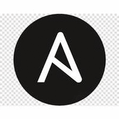
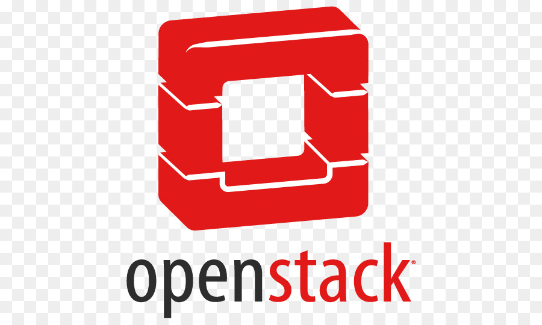
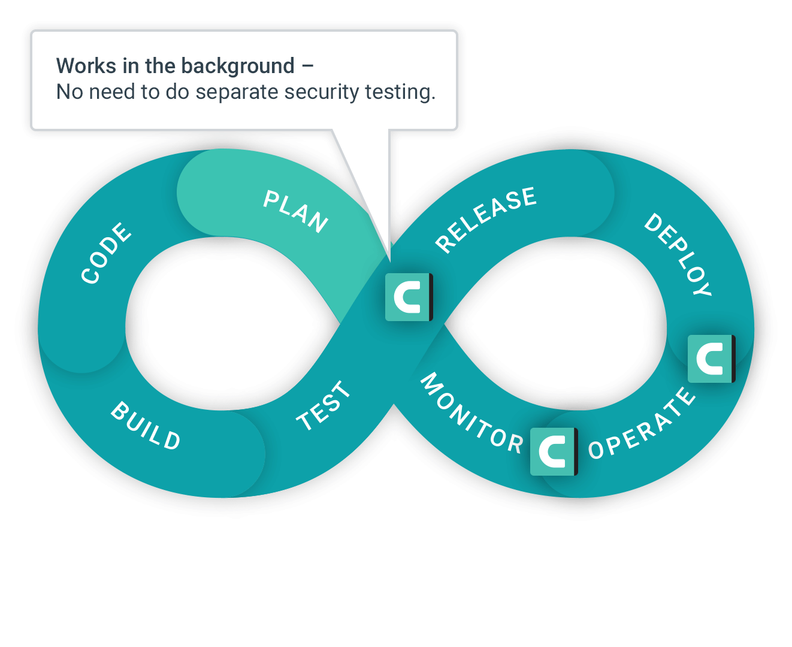

### Hi there 👋

<!--
**jabhishek87/jabhishek87** is a ✨ _special_ ✨ repository because its `README.md` (this file) appears on your GitHub profile.

Here are some ideas to get you started:

- 🔭 I’m currently working on ...
- 🌱 I’m currently learning ...
- 👯 I’m looking to collaborate on ...
- 🤔 I’m looking for help with ...
- 💬 Ask me about ...
- 📫 How to reach me: ...
- 😄 Pronouns: ...
- ⚡ Fun fact: ...
-->

I am [Abhishek](http://jabhishek87.github.io/), full time python Programmer, part time system designer and Innovative creator from [🇮🇳 ](https://en.wikipedia.org/wiki/India)&nbsp;with a strong interest in Open-Source. 🎯

I mostly work with Python Infra and Cloud-Native technologies.☁️🚀

# Programming Language and Frameworks

    
    
    
 

# Cloud Services and Tools

    
    
    
    
    
    
    
 

### 📫 How to reach me?
  ⦿ Connect with me on [LinkedIn](https://www.linkedin.com/in/jabhishek87/) 👨🏻‍💻  
  ⦿ Follow me on [Twitter](https://twitter.com/jabhishek87) 🦠 
  ⦿ Shoot Me an [Email](mailto:abhishekjaiswal.kol@gmail.com) 💌  
